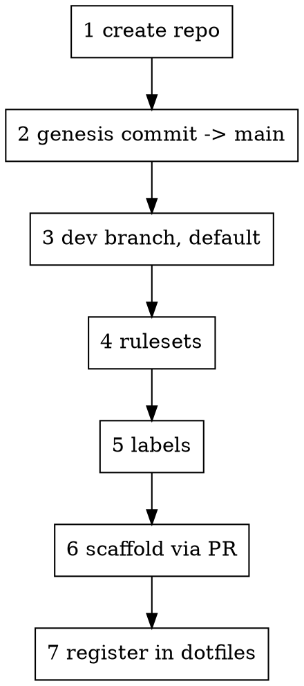

# Bootstrapping a product repo

Every repo in this org carries the same branching model, the same three rulesets, the same label
taxonomy, and the same `CI Success` gate. This gets a new one there in one pass.

**More than half of it is repo *state*, not files** — branches, rulesets, labels, Actions access. That
is why this is a skill and not a GitHub template repo: a template copies files and stops.

## Order matters

The steps are not independent. Two of them are ordering traps that cost real time when hit in the
wrong sequence, so do them in this order.



## 1. Create the repo

```bash
gh repo create GarrettMakesItLLC/<Name> --private --description "<one line>"
git clone git@github.com:GarrettMakesItLLC/<Name>.git ~/workspace/<Name>
```

Name it as the product is named. The directory under `~/workspace/` matches the repo name exactly —
`dotfiles`' `repo` helper and `bootstrap/device.sh` both assume that.

## 2. Genesis commit, directly to `main`

**An empty remote has no branch to open a PR against.** There is no way to PR into an unborn default
branch, so the first commit goes straight to `main`. Everything after it is a PR.

Keep genesis small and coherent — enough to establish the branch:

```bash
cd ~/workspace/<Name>
# minimum: README.md, .gitignore
git add -A && git commit -m "chore: initial repo scaffolding" && git push -u origin main
```

**Do not put `.worktrees/` in `.gitignore` yet.** `git worktree add` needs a commit to branch from,
so declaring the convention before genesis makes `worktree-guard.sh` block every edit with no
worktree available to satisfy it. Add it in step 6, once `main` exists.

## 3. `dev`, and make it default

```bash
MAIN=$(gh api repos/GarrettMakesItLLC/<Name>/git/ref/heads/main --jq .object.sha)
gh api repos/GarrettMakesItLLC/<Name>/git/refs -f ref=refs/heads/dev -f sha="$MAIN"
gh api -X PATCH repos/GarrettMakesItLLC/<Name> -f default_branch=dev
```

## 4. Rulesets

Three per repo. Definitions are in `references/rulesets/` — they are identical across every repo,
which is the point.

```bash
for f in stage prod copilot; do
  gh api -X POST repos/GarrettMakesItLLC/<Name>/rulesets \
    --input ~/.claude/skills/bootstrapping-a-product-repo/references/rulesets/$f.json
done
```

| Ruleset | Targets | Merge method | Requires |
| --- | --- | --- | --- |
| `StagePR` | `~DEFAULT_BRANCH` | squash | `CI Success` |
| `ProdPR` | `refs/heads/main` | **merge commit only** | `CI Success` |
| `Copilot review for default branch` | `~DEFAULT_BRANCH` | — | — |

Merge-commit-only on `main` is load-bearing: squashing a promotion rewrites every release commit and
breaks version computation. Enforcing it here makes the mistake impossible rather than documented.

**Never require a status check no workflow produces.** It makes every PR permanently unmergeable —
GitHub waits forever for a context that will never arrive. If CI does not exist yet, create these
rulesets *without* `required_status_checks`, then add the checks once a real run has produced them.
Confirm the exact context strings from a run rather than from the workflow file:

```bash
gh pr checks <N> --repo GarrettMakesItLLC/<Name> --json name,bucket
```

For an infrastructure repo with no `dev` (like `ci` or `dotfiles`), skip `StagePR` and point `ProdPR`
at `main` — a `dev` branch on a config repo is ceremony.

## 5. Labels

```bash
# labels_ensure MCP tool (github-rest), then remove stock labels that carry zero usage
```

Use the `labels_ensure` tool, then `labels_audit` to see what is left over. GitHub's stock labels get
**deleted only at zero usage** — a label attached to a closed issue is erased from that history by a
delete, so those are retitled `DEPRECATED …` instead. `labels_audit` reports both cases.

Taxonomy and the deprecation rules: `managing-work-with-issues`.

## 6. Scaffold the rest, as a PR

`references/scaffold/` holds the files. Copy them in, fill the placeholders, and open a PR into `dev`.
Now that `main` exists, adopt the worktree convention first:

```bash
cd ~/workspace/<Name>
git worktree add .worktrees/bootstrap -b chore/repo-foundation
cd .worktrees/bootstrap
```

| File | Notes |
| --- | --- |
| `CLAUDE.md` | Autonomy line first. Describe what the repo **is**, not what it will be — mark planned layout as not-yet-present. |
| `.github/workflows/ci.yml` | The `CI Success` job name is what the rulesets require. Do not rename it. PR-title linting is the `lint-pr-title` job inside this file, not a standalone workflow — it joins `ci-success`'s `needs:` rather than being independently required. |
| `.github/workflows/issue-status-clear.yml` | Strips `status:*` on close. |
| `package.json`, prettier, markdownlint, commitlint, husky | See the traps below. |
| `.gitignore` | Add `.worktrees/` and `.claude/settings.local.json` here. |
| `.editorconfig`, `.claude/settings.json` | |

**Not** `.github/ISSUE_TEMPLATE/` or `.github/PULL_REQUEST_TEMPLATE.md`. `GarrettMakesItLLC/.github`
supplies those to every repo that does not define its own — a local copy is drift, and it has to be
updated in five places forever.

**Run `graphify install --project` in this same PR, not later.** The context-tools scaffold
(`.husky/post-merge`/`post-checkout`, the `graphify` CI job — see `rules/context-tools.md`) ships
inert until a repo has an actual graph; every developer on every repo should have this working from
day one, not as a manual step someone remembers or forgets. Run it, commit the `.claude/skills/graphify/`
marker and `graphify-out`'s gitignored build alongside the rest of the scaffold, and verify the hooks
pick it up (same check as any other scaffold file — see the traps below).

### Traps in this step

- **`husky init` writes `npm test` as the pre-commit hook**, which fails on every commit when there
  is no test script. Replace it with the repo's real check.
- **Pin the current action majors** — `actions/checkout@v7`, `actions/setup-node@v6`,
  `actions/cache@v6`. Verify the *tag* exists, not the newest release: these repos move major tags
  ahead of their release list, so `gh api repos/actions/cache/releases` showing v5 does not mean `@v6`
  is invalid.

  ```bash
  gh api repos/actions/cache/git/ref/tags/v6 --jq .ref
  ```

- **`markdownlint` fires MD041 on `.github/PULL_REQUEST_TEMPLATE.md`** if one exists locally — those
  are forms, not documents. Add them to the ignore list rather than bending the template.
- **Run the checks before opening the PR**, and confirm the required contexts actually appear on it.

## 7. Register it for device bootstrap

One line in `GarrettMakesItLLC/dotfiles` → `bootstrap/repos.tsv`, or a new machine will not clone it:

```text
<Name>	product	npm	-
```

Fields are tab-separated: repo, role (`product`/`infra`/`archive`), package manager
(`npm`/`pnpm`/`none`), and a post-install command or `-`.

## Consuming shared config

A new repo should not carry its own copy of anything the org already publishes:

| Want | Where it comes from |
| --- | --- |
| Issue and PR templates | `GarrettMakesItLLC/.github`, automatically |
| Composite actions, reusable workflows | `GarrettMakesItLLC/ci`, pinned `@v1` — never `@main` |
| Design system, shared logic, lint/tsconfig | `@gmi/*` from GitHub Packages |

Calling `GarrettMakesItLLC/ci` from a private repo needs Actions access granted, or every `uses:`
resolves to a 404 that reads like a typo:

```bash
gh api -X PUT repos/GarrettMakesItLLC/<Name>/actions/permissions/access -f access_level=organization
```

## Verify before handing off

```bash
gh api repos/GarrettMakesItLLC/<Name> --jq .default_branch                    # dev
gh api repos/GarrettMakesItLLC/<Name>/rulesets --jq '[.[].name]'              # the three
gh api "repos/GarrettMakesItLLC/<Name>/labels?per_page=100" --jq length       # 18
gh pr checks <N> --repo GarrettMakesItLLC/<Name>                              # contexts exist and pass
```

A repo whose ruleset requires a context that never appeared is worse than an unprotected one: it looks
protected and cannot merge.
